# Lab 400 - HCM Integration

## Introduction

This is the forth of several labs that are part of the **ICS Development** workshop. 

In this lab, you will test the integration that was created in Lab 300 and see how the Integration is replicated into HCM Cloud.

## Part 1: Activating the ICS Integration

Before we start testing the integration, you need to activate the integration for testing.

**1.1** Go to Integration "ICSHCM Add Talent Profile UserXX" created in lab 300. On the right side of the integration click on the switch button to activate the integration.

**1.2** Make sure to tick "enable tracing" and "include payload" when the window pops up. Click on the activate button to activate it.

**1.3** When the integration is activated the switch turns to green. A green tab with success messge and url endpoint pops up on top. You can close it by clicking on 'X' button.

**1.4** Next to green switch click on 'i' icon which gives the details about the integration. Make a note of the url endpoint which will be used for testing the integration.

---

### **1.2**: Test Using SoapUI

**1.2.1** Open SoapUI.  If you don't already have this installed, follow the instructions provided in the **Prerequisites** section of this workshop.

**1.2.2** Click on the **SOAP** button so we can create a new project for testing our new ICS SOAP Web Service

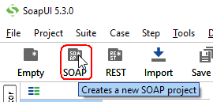

**1.2.3** In the **New SOAP Project** dialog window, paste the Endpoint URL from the integration information we noted in the previous section into the **Initial WSDL** window and give a meaningful **Project Name** such as _User03 ICSHCM Add Talent Profile_.  Keep the checkbox selected for **create sample requests for all operations?**.  Click on the **OK** button after you've initialized the settings for your new SoapUI SOAP project.

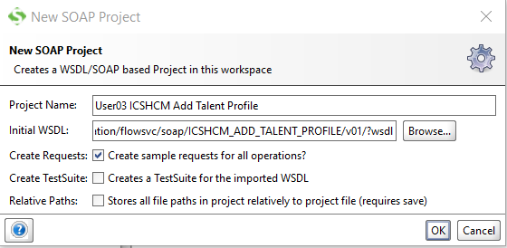

**1.2.4** The new SOAP Project will appear in the left-hand navigation.

**1.2.5** Expand the **addTalentProfileData** operation by clicking on it, then open the auto-generated sample request **Request 1** by double-clicking on it.  An empty request payload will be generated.

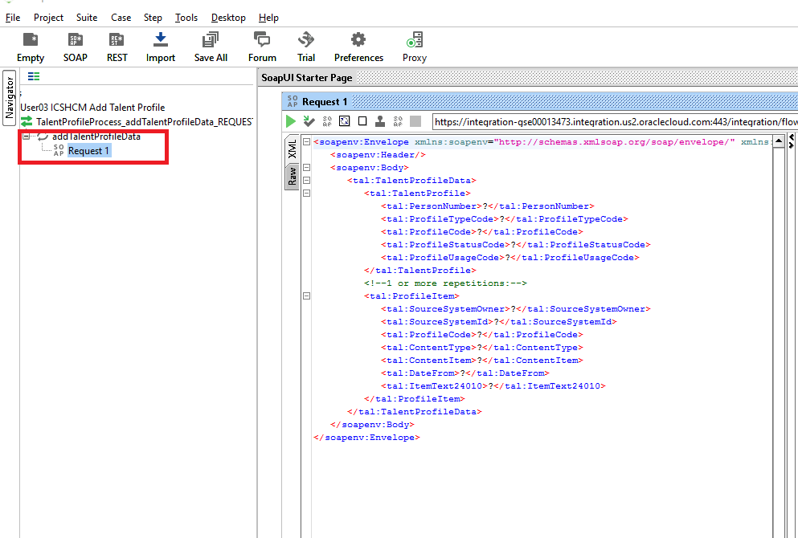

**1.2.6** Remove the request that was autogenerated.

**1.2.7** We will be using one of the below 3 sample requests for testing each having different content item.

Copy paste one of the below request in the 'Request 1 section'. 

Note: Each request for Athlete or Artist or Photographer has UserXX added so that each user request is treated as a unique request and each user can verify the same user name in the HCM too.

**1. Request  payload for Athlete:**

	<soapenv:Envelope xmlns:soapenv="http://schemas.xmlsoap.org/soap/envelope/" xmlns:tal="http://icshcmpoc.oracle.com/TalentProfileData">
	<soapenv:Header>

	</soapenv:Header>
	<soapenv:Body>
	<tal:TalentProfileData>
	<tal:TalentProfile>
	<tal:PersonNumber>98</tal:PersonNumber>
	<tal:ProfileTypeCode>PERSON</tal:ProfileTypeCode>
	<tal:ProfileCode>PERS_300000047881516</tal:ProfileCode>
	<tal:ProfileStatusCode>A</tal:ProfileStatusCode>
	<tal:ProfileUsageCode>P</tal:ProfileUsageCode>
	</tal:TalentProfile>
	<!--1 or more repetitions:-->
	<tal:ProfileItem>
	<tal:SourceSystemOwner>ICS_HCM_GSE</tal:SourceSystemOwner>

	<tal:SourceSystemId>ADDITIONAL_QUALIFICATIONS_98_ATHELETE</tal:SourceSystemId>
	<!--Make sure that SourceSystemId is always unique-->
	<tal:ProfileCode>PERS_300000047881516</tal:ProfileCode>
	<tal:ContentType>ADDITIONAL_QUALIFICATIONS</tal:ContentType>

	<!--Can use inputs like Artist or Photographer (OOTB created) -->

	<tal:ContentItem>AthleteUserXX</tal:ContentItem>
	<tal:DateFrom>2017/05/31</tal:DateFrom>

	<!--Enter description of your choice-->

	<tal:ItemText24010>I'm an athlete </tal:ItemText24010>
	</tal:ProfileItem>
	</tal:TalentProfileData>
	</soapenv:Body>
	</soapenv:Envelope>

**2. Request  payload for Artist:**

	<soapenv:Envelope xmlns:soapenv="http://schemas.xmlsoap.org/soap/envelope/" xmlns:tal="http://icshcmpoc.oracle.com/TalentProfileData">
	<soapenv:Header>

	</soapenv:Header>
	<soapenv:Body>
	<tal:TalentProfileData>
	<tal:TalentProfile>
	<tal:PersonNumber>98</tal:PersonNumber>
	<tal:ProfileTypeCode>PERSON</tal:ProfileTypeCode>
	<tal:ProfileCode>PERS_300000047881516</tal:ProfileCode>
	<tal:ProfileStatusCode>A</tal:ProfileStatusCode>
	<tal:ProfileUsageCode>P</tal:ProfileUsageCode>
	</tal:TalentProfile>
	<!--1 or more repetitions:-->
	<tal:ProfileItem>
	<tal:SourceSystemOwner>ICS_HCM_GSE</tal:SourceSystemOwner>

	<tal:SourceSystemId>ADDITIONAL_QUALIFICATIONS_98_ARTIST</tal:SourceSystemId>
	<!--Make sure that SourceSystemId is always unique-->
	<tal:ProfileCode>PERS_300000047881516</tal:ProfileCode>
	<tal:ContentType>ADDITIONAL_QUALIFICATIONS</tal:ContentType>

	<!--Can use inputs like Artist or Photographer (OOTB created) -->

	<tal:ContentItem>ArtistUserXX</tal:ContentItem>
	<tal:DateFrom>2017/05/31</tal:DateFrom>

	<!--Enter description of your choice-->

	<tal:ItemText24010>I'm a painter </tal:ItemText24010>
	</tal:ProfileItem>
	</tal:TalentProfileData>
	</soapenv:Body>
	</soapenv:Envelope>

**3. Request  payload for Photographer:**

	<soapenv:Envelope xmlns:soapenv="http://schemas.xmlsoap.org/soap/envelope/" xmlns:tal="http://icshcmpoc.oracle.com/TalentProfileData">
	<soapenv:Header>

	</soapenv:Header>
	<soapenv:Body>
	<tal:TalentProfileData>
	<tal:TalentProfile>
	<tal:PersonNumber>98</tal:PersonNumber>
	<tal:ProfileTypeCode>PERSON</tal:ProfileTypeCode>
	<tal:ProfileCode>PERS_300000047881516</tal:ProfileCode>
	<tal:ProfileStatusCode>A</tal:ProfileStatusCode>
	<tal:ProfileUsageCode>P</tal:ProfileUsageCode>
	</tal:TalentProfile>
	<!--1 or more repetitions:-->
	<tal:ProfileItem>
	<tal:SourceSystemOwner>ICS_HCM_GSE</tal:SourceSystemOwner>

	<tal:SourceSystemId>ADDITIONAL_QUALIFICATIONS_98_PHOTOGRAPHER</tal:SourceSystemId>
	<!--Make sure that SourceSystemId is always unique-->
	<tal:ProfileCode>PERS_300000047881516</tal:ProfileCode>
	<tal:ContentType>ADDITIONAL_QUALIFICATIONS</tal:ContentType>

	<!--Can use inputs like Artist or Photographer (OOTB created) -->

	<tal:ContentItem>PhotographerUserXX</tal:ContentItem>
	<tal:DateFrom>2017/05/31</tal:DateFrom>

	<!--Enter description of your choice-->

	<tal:ItemText24010>I'm a wild life photographer </tal:ItemText24010>
	</tal:ProfileItem>
	</tal:TalentProfileData>
	</soapenv:Body>
	</soapenv:Envelope>

---

**1.2.8** Next we need to add the authorization credentials so ICS will allow the request from SoapUI.  ICS uses basic username/password authentication.

**1.2.9** Click on the **Auth** button in the lower-left of the **Request 1** SoapUI window

**1.2.10** In the **Authorization** dropdown, select _Add New Authorization..._

**1.2.11** In the **Add Authorization** dialog pop-up window, select **Type** of _Basic_ form the picklist, then select the **OK** button.

**1.2.12** Fill in your assigned username and password in the **Auth (Basic)** window at the bottom of the SoapUI request window

**1.2.13** ICS needs two headers in the request payload to satisfy the enforced Web Services Security (WSS) standards.  It needs both the **WSS Username Token** and the **WS-Timestamp**.

**1.2.14** Insert the **WSS Username Token** by right-clicking in the Request payload body and select **Add WSS Username Token** from the pull-down list

**1.2.15** In the **Specify Password Type** dialog pop-up window, select _PasswordText_ as the WSS Username Token type, then click on the **OK** button.

**1.2.16** Insert the **WS-Timestamp** by right-clicking in the Request payload body and select **Add WS-Timestamp** from the pull-down list

**1.2.17** In the **Specify Time-To-Live value** dialog pop-up window, set the value (in milliseconds) to _60000_ (60 seconds), then click on the **OK** button.

**1.2.18** Finally your request payload is ready to send to ICS.

**1.2.19** Click on the green _Submit Request_ arrow in the upper left of the **Request 1** window.

**1.2.20** The right side of the **Request 1** SoapUI window will display the results of the ICS integration call.

**1.2.21** The return payload of the ICS integration will show the Job ID Number.

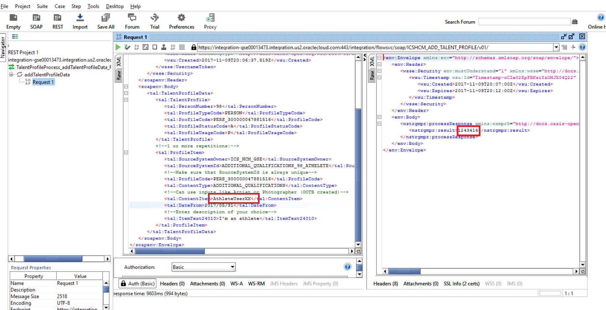

### **1.3:** Verify in HCM

To verify data is actually loaded into HCM and associated with the right person, we need to access HCM web UI

---

**1.3.1** Log into the HCM Cloud application using the details:

URL - https://ucf6-fap0868-fs.oracledemos.com/homePage/faces/AtkHomePageWelcome

Login as a HR Specialist - betty.anderson

password - Please ask the instructor for the password or look into the supplement provided by the instructor.

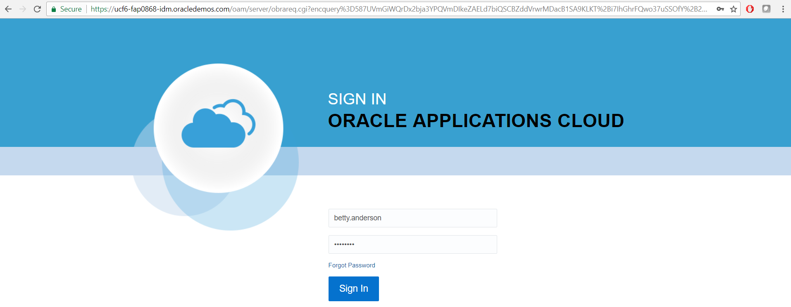

**1.3.2** You will see the home page. Select the `Hamburger` menu icon on left and within the navigator manual click on profiles under 'My Workforce'.

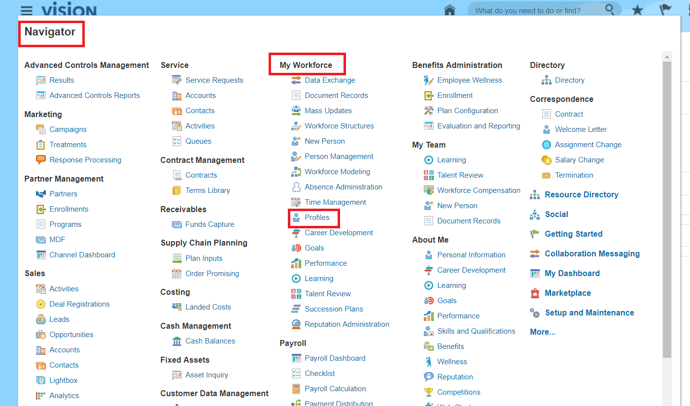

**1.3.3** Search for the person “doug” targeted in the data loading.

**1.3.4** Click on the person “Doug Stonewood” when the pop up comes up.

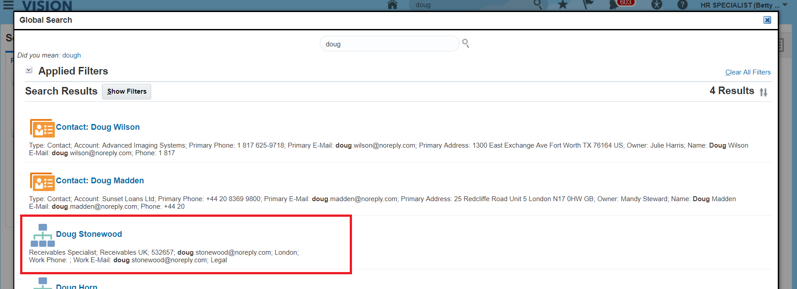

**1.3.5** Click on "Skills and Qualifications” on left hand side panel view. You will see “Additional Qualifications” section is added to that person’s profile.

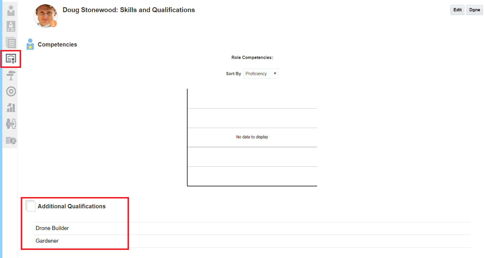

**1.3.6** Click on “Edit “ to check the description.

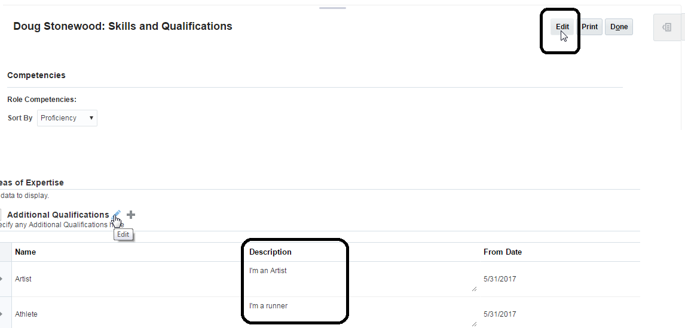

**1.3.7** Testing is complete. Below given steps is additional info on debugging issues. If you want to debug  the data load issues  click on navigator and under 'My Workforce' click on 'Data Exchange' to check the data uploaded process details  using HCM user betty.anderson.

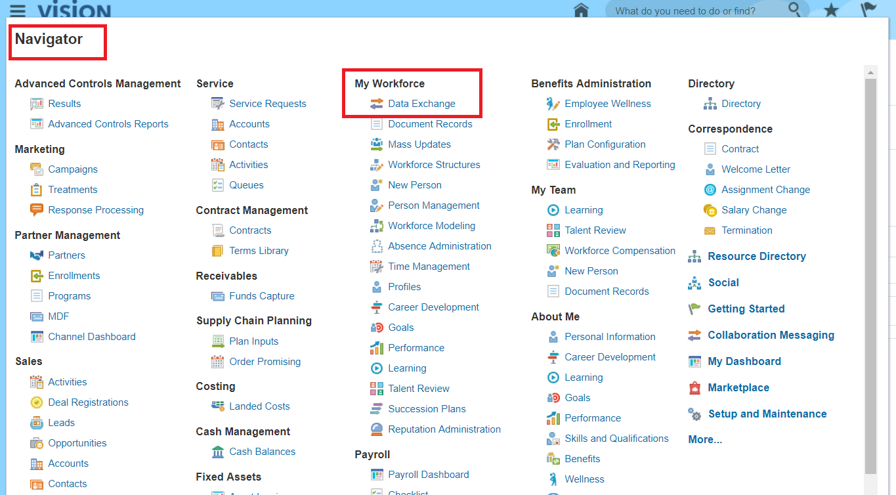

**1.3.8** Click on task icon on the right hand side of the page.

**1.3.9** Click on Import and load data. The summary of data upload is shown. The status and process details can be seen. Logs can also be downloaded to debug issues.

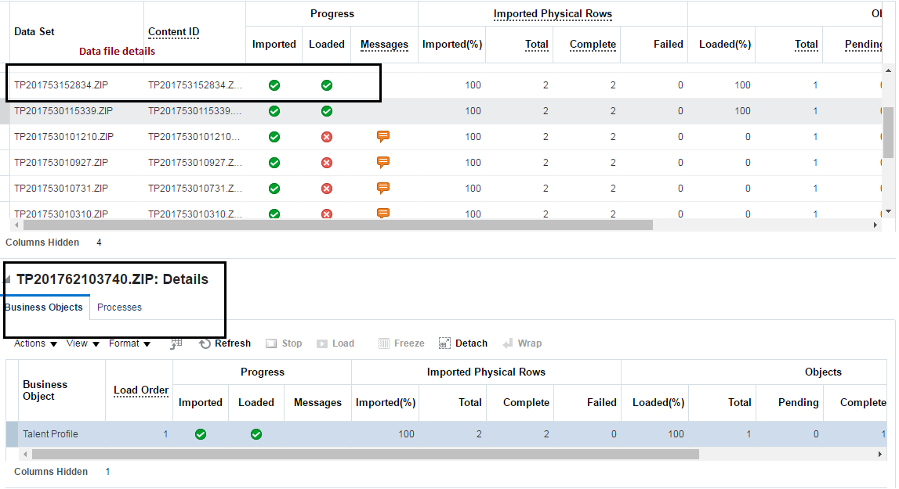

You have now completed the final lab of the ICS Developer Workshop.  

Congratulations! You should now have a much better understanding of how to work with ICS to create complex integrations.
